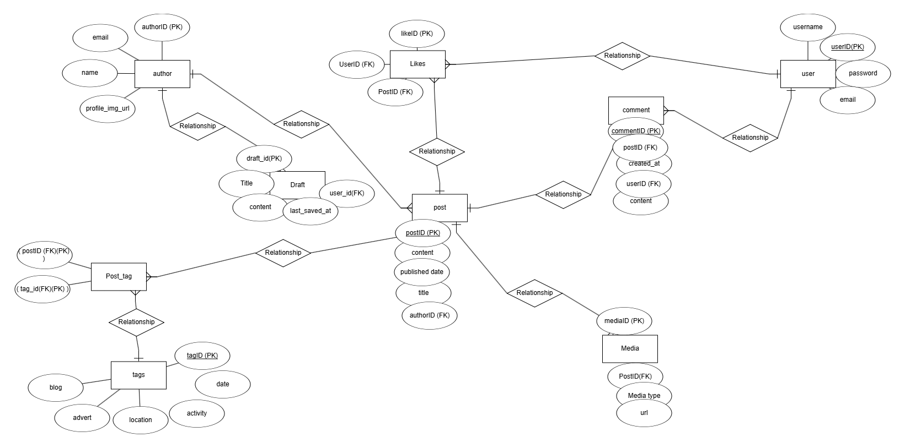
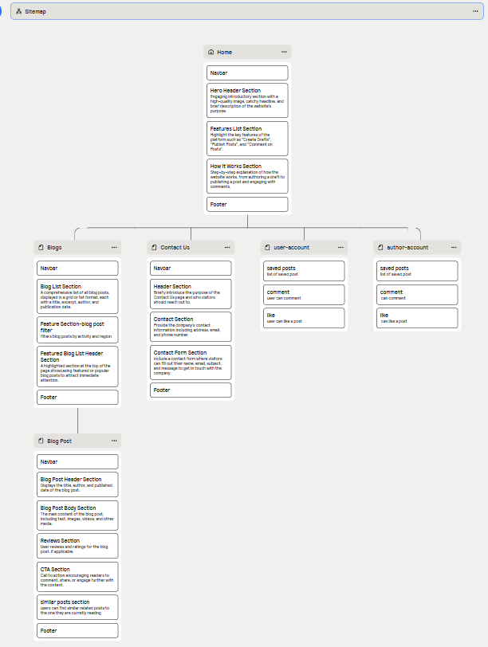
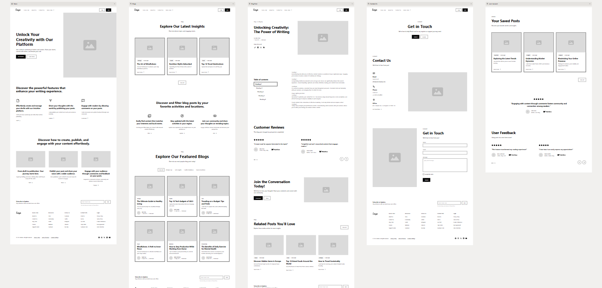

#Adventure Finder 
Welcome Danny O'Brien,


## Contents:

- <a href="#ux">UX</a>
  - <a href="#strategy">Strategy</a>
  - <a href="#db">Database structure</a>
  - <a href="#design">Design</a>
- <a href="#features">Existing Features</a>
- <a href="#f_features">Features left to Implement</a>
- <a href="#testing">Testing</a>
- <a href="#bugs">Bugs</a>
- <a href="#technology">Languages, Technologies & Libraries</a>
- <a href="#credits">Credits</a>
- <a href="#deployment">Deployment</a>
- <a href="#acknowledgements">Acknowledgements</a>

## <div id="ux">UX</div>
### Overview
Adventure Finder is a vlog and blog app that allows users to  easily find adventures  within activities and locations they are interested in. the adventure finder app is a community of outdoor enthusiasts looking to find information about an outdoor activity, location, local businesses and be able comment or like on thier favorite posts. Magazine style operated with only featured user stories written by designated approved authors.


### <div id="strategy">Strategy</div>
Determining the best approach meant studying the needs of potential users. This included similar sites research and taking inspiration

### <div id="db">DataBase structure</div>


#### Agile
The Agile methodology was used to plan the project. Github was used as the tool to demonstrate this.  Issues were used to create User Stories with custom templates ([Link to Kanban board](https://github.com/users/dannyobrien761/projects/1/views/1)). 

### <div id="design">Design practice</div>
I separated the urls.py files into separate apps because, as stated, this follows the Django design philosophy of loose coupling. 
##### User Stories 
Issues were used to create User Stories with custom templates for admin and user. I added the acceptance criteria and the tasks so I can track my work effectively. Once I completed a User Story I would move it from `in progress` to `completed`. 

the acceptance criteria was formulated  from the card conversation and confirmation appraoch

- Completed User Stories titles:<br />

 

- Uncompleted User Stories titles:<br/>

    

  ---

  superuser created for django admin CRUD operations 


#### First Time User
- As a person who is interested in outdoor adventures.
- As a person who is looking for more information about an activity or location of interest.
- As a person who prefers to see videos of these activitites the business that run them and the location.

#### Returning User
- As a returning user, part of the adventure finder community.
- As a returning user, who already has an account I would like quickly and easily comment on posts and find out more information.
- As a returning user, I would like to see the newest adventures on the site at the locations and activities I am interested in.
-as a returning user i would like to see suggested similar posts to the ones I am reading so I can easily navigate to the next. 

# Completed User Stories

## First Time User

- **As a person who is interested in outdoor adventures,** I want to easily find information about outdoor activities and locations so that I can plan my next adventure.
- **As a person looking for more information about a specific activity or location,** I want to see detailed posts with images, videos, and descriptions so that I can make an informed decision.
- **As a person who prefers video content,** I want to see videos of activities, businesses, and locations so that I can better visualize the experience.
- **As a first-time visitor to the site,** I want clear navigation and filtering options so that I can quickly find the type of adventures that interest me.
- **As someone new to the platform,** I want a visually appealing and easy-to-use interface so that I feel encouraged to explore more content.

## Returning User

- **As a returning user who is part of the Adventure Finder community,** I want to quickly log in to my account so that I can comment and engage with posts.
- **As a returning user who has an account,** I want to see the newest adventures related to my interests on the homepage so that I can stay updated.
- **As a returning user,** I want suggested similar posts displayed on the posts I read so that I can easily navigate to related content.
- **As a community member,** I want to like posts that I enjoy so that I can show appreciation for the content.


## Admin User

- **As an admin user,** I want to review and approve user comments so that only appropriate content is displayed.
- **As an admin,** I want to create and manage tags for posts so that content can be categorized effectively.
- **As an admin user,** I want to edit or remove inappropriate posts so that the community maintains a positive atmosphere.
- **As an admin,** I want to monitor site activity and user engagement so that I can identify popular content and improve user experience.
- **As an admin user,** I want to access analytics about post views and user interactions so that I can make informed decisions about future updates.

## General User Stories

- **As a user,** I want to filter posts by location, activity, or type so that I can find adventures tailored to my interests.
- **As a user,** I want to view featured posts on the homepage so that I can discover popular adventures.
- **As a user,** I want a search bar to quickly find specific posts or topics so that I save time.
- **As a user,** I want the site to load quickly and efficiently so that I have a smooth browsing experience.
- **As a user,** I want to access the site from my mobile device and still have a great experience so that I can browse on the go.

### Design choices
#### sitemap


#### wireframes


#### colors


# Features

### comment feature
I took the origional code for the comment feature from the code institute step by step code star project and then modified it in the below ways to suit my project and its outcomes:


class Comment(models.Model):
  author = models.ForeignKey(Author, on_delete=models.CASCADE, related_name='comments', null=True, blank=True)
  user = models.ForeignKey(User, on_delete=models.CASCADE, related_name='comments')


The author field is set as null=True, blank=True, so it’s only populated if the commenter is an author.
This setup enables the app to differentiate between comments from authors and regular users


approved = models.BooleanField(default=False)

ensures that new comments are unapproved by default, making it easy to manage comment moderation.
This setup will let you handle comment approval efficiently, with all new comments defaulting to unapproved.

#### comment editing

changed this :
``` html

            <button class="btn btn-edit"
                comment_id="{{ comment.id }}">Edit</button>
            
```
to this :
``` html
% if user.is_authenticated and comment.user == user %}
          <button class="btn btn-edit" comment_id="{{ comment.id }}">Edit</button>
          
          <button class="btn btn-edit" comment_id="{{ comment.id }}">Edit</button>
          
``` 
to allow users and author to comment and edit 


changed : const commentText = document.getElementById("id_body");
to : const commentText = document.getElementById("id_content");  // Change to match the content field
for the commentForm in forms.py :

class CommentForm(forms.ModelForm):
    class Meta:
        model = Comment
        fields = ('content',)
### Tag feature(CUSTOM)
this is one of my origional custom models for this projet. 
the tag feature allows authorized users ie "blog authors" to create tags for individual posts. The Tag model defines "Choices" for LOCATION, ACTIVITIES, and TYPE with separate choice fields that lets you to select each attribute individually for a desired post.

- **Simplifies Filtering:** Each attribute (location, activity, type) has its own field, making it easier to filter tags by these specific fields.
- **Greater Flexibility:** You’re not limited to a single category per tag. You can set a tag to have a specific location, activity, and type simultaneously.
- **User-Friendly:** If users are selecting these attributes in the admin interface, it’s straightforward, as each field has defined options.
- **Nullability**: I set blank=True and null=True to make each field optional. This way, a tag could specify only a location, only an activity, or all three.
-**USER Experience**:
it helps categorize blog posts and allows for a better user experience as users can filter for specific locations or activities they are interested in.

### Tag Listing Feature (CUSTOM)

The **Tag Listing** feature displays all tags associated with a specific post on the `post_detail.html` page. This allows users to quickly identify the key topics, locations, or activities covered in the post.

#### Custom Code Highlights

1. **Tag Retrieval**:  
   - Utilizes the `PostTag` model to fetch tags related to the current post.
   - Uses Django's ORM to query and join the `Post` and `Tag` models for efficient data retrieval.

2. **Dynamic Rendering**:  
   - Passes the retrieved tags to the template and iterates through them to display each tag as a list item.
   - Provides a fallback message (`No tags available`) if no tags are associated with the post.

3. **Seamless Integration**:  
   - Ensures the tags are visually presented in an organized format (e.g., as a list or inline links) to enhance the user experience and improve navigation to related topics.

This feature enables readers to easily understand the themes of the post and discover related content.


### Related Posts Feature (CUSTOM)
there is a similar posts suggestion panel at the bottom of each post entry, this allows for easy navigation between posts of similar topics and keeps the interest of the users on the site. 


The **Related Posts** feature enhances user engagement by displaying posts that share common tags with the current post. It identifies related posts based on shared tags (e.g., Location, Activity, or Type). The logic ensures that users can explore similar content effortlessly.

#### Custom Code Highlights

1. **Tag Matching Logic**:  
   - Retrieves tags associated with the current post using a many-to-many relationship (`PostTag`).
   - Filters other posts containing at least one of the same tags, excluding the current post.

2. **Efficient Querying**:  
   - Uses Django ORM to dynamically fetch related posts with optimized filtering and ordering (`filter()` and `exclude()`).

3. **Display**:  
   - Passes the fetched related posts to the template for a seamless frontend display in a grid layout, or shows a fallback message if no related posts are found. 

This feature makes content discovery intuitive and improves the overall user experience.

#### storing images and videos in cloudinary

I follewed the step by step codestar project to achieve the cloudinary integration with my app. Found here :
!(cloudinary setup)[https://github.com/Code-Institute-Solutions/blog/tree/main/14_where_to_put_things/01_storing_images_in_cloudinary]
##### Conclusion:
tags are tied to posts by PostTag junction table and offer clear filtering and display options detailing location of post, activity featured and the type of post in my adventures app.


## <div id="f_features">features left to implement</div>
## Future Enhancements
- **As a user who frequently visits the site,** I want to bookmark my favorite posts so that I can return to them easily.
- **As a user,** I want to receive personalized recommendations based on my past activity so that I discover content relevant to my interests.
- **As a user,** I want to join groups or forums with other community members so that I can share experiences and plan adventures together.
- **As a user,** I want to follow specific authors or tags so that I am notified about new content in my areas of interest.
 
- I would like to add a author filter and filter for posts for specific authors.
- add a page for authors bios


# testing


## Functional Testing

Functional testing ensures that all components of the project work as expected.

### Comment Feature

- **Goal:** Allow authenticated users and authors to comment and edit comments.

#### Test Case 1:
- **Action:** Authenticate a regular user, post a comment, and verify if it appears as unapproved by default.
- **Result:** Comment posted successfully, marked as unapproved.
- **Improvement Suggestion:** Add a visual cue (e.g., a pending status) for users indicating their comment is awaiting approval.

#### Test Case 2:
- **Action:** Log in as an author, post a comment, and ensure the author can edit it.
- **Result:** Comments by authors were editable as expected.

#### Edge Case:
- **Action:** Ensure anonymous users cannot post comments.
- **Result:** Anonymous users were blocked from posting comments as expected.

### Tagging System

- **Goal:** Ensure tags categorize posts correctly and provide effective filtering.

#### Test Case 1:
- **Action:** Create a tag with only a location attribute and associate it with a post.
- **Result:** Tag successfully saved and displayed in post details.

#### Test Case 2:
- **Action:** Filter posts by a tag’s location or activity attribute.
- **Result:** Filtering produced accurate results for each attribute tested.
- **Improvement Suggestion:** Add a multi-tag filtering system to refine search results further.

### Similar Post Suggestions

- **Goal:** Display similar posts at the bottom of a post's details page.

#### Test Case:
- **Action:** Access a post and confirm that similar posts (based on tags or activity) appear.
- **Result:** Relevant posts were displayed successfully.
- **Improvement Suggestion:** Provide an option to see more suggestions if users want extended results.

## Integration Testing

Integration testing validates interactions between different components.

### Database and Views

#### Test Case:
- **Action:** Verify data flow from the database to the front-end views (e.g., for comments and tags).
- **Result:** Data retrieved and rendered correctly.
- **Improvement Suggestion:** Optimize database queries to improve response times for views with complex filtering.

### Cloudinary Integration

#### Test Case:
- **Action:** Upload images and videos for a post and ensure they are displayed correctly in Cloudinary.
- **Result:** Media uploads were stored and rendered without errors.
- **Improvement Suggestion:** Add upload progress indicators for better user feedback.

## Usability Testing

Evaluates user experience to ensure the application is intuitive.

### Navigation

- **Goal:** Allow users to navigate easily between posts and features.
- **Observation:** Users could navigate using the suggested posts panel and search/filter options effectively.
- **Improvement Suggestion:** Add a breadcrumb trail for deeper navigation paths.

### Accessibility

#### Test Case:
- **Action:** Use screen readers to access key features like commenting and filtering.
- **Result:** Basic accessibility standards were met, but certain aria-labels were missing.
- **Improvement Suggestion:** Enhance accessibility by adding labels and ensuring all interactive elements are keyboard-navigable.

### Design and Layout

#### Test Case:
- **Action:** Check responsiveness on various devices (desktop, tablet, mobile).
- **Result:** Layout adjusted correctly across screen sizes.
- **Improvement Suggestion:** Optimize large image or video loading on mobile devices to improve page load times.

## Performance Testing

#### Test Case 1:
- **Action:** Measure page load times for the home and post details pages.
- **Result:** Home page loaded in under 2 seconds, but post details took longer with large media.
- **Improvement Suggestion:** Compress images and use lazy loading for videos.

#### Test Case 2:
- **Action:** Simulate concurrent users accessing the site.
- **Result:** App maintained stability with up to 50 concurrent users.
- **Improvement Suggestion:** Investigate caching solutions for scaling.


### Bugs

#### bug fix issues :

##### django.template.loaders.filesystem.Loader: /workspace/adventure-finder/templates/base.html (Source does not exist)
  Django was looking for templates in wrong location, ran the server found the path djamgo was looking for the base.html file in and realized it was different : workspace/adventure-finder/adventure_finder/templates/base.html . I adjusted the TEMPLATES_DIR = os.path.join(BASE_DIR, 'adventure_finder', 'templates') and it solved the bug allowing django to find the base.html file in the app when it was extended in the index.html file.

## <div id="deployment">Deployment</div>


The site was deployed following the below steps:

### Steps locally:

- Install Dependencies: pip install -r requirements.txt
- Apply Migrations: python manage.py migrate
- python manage.py runserver- Visit: http://127.0.0.1:8000
### Steps on heroku:
- Install dependencies: `gunicorn`, `whitenoise`
- Update requirements.txt: pip freeze > requirements.txt
- Add `Procfile` : add  web: gunicorn adventure_finder.wsgi
- Update `settings.py` for production -set debug to false
- Allow Heroku host: ALLOWED_HOSTS = ['127.0.0.1', '.herokuapp.com']
- Configure static files for Whitenoise: MIDDLEWARE.insert(1, 'whitenoise.middleware. WhiteNoiseMiddleware'), STATIC_ROOT = BASE_DIR / 'staticfiles'
- downloaded and installed the Heroku CLI for debugging issues
- Commit your changes:git add . , git commit -m "Prepare for Heroku deployment"
- Push the project to Git
- create heroku app and link heroku app to github repository
- Set necessary environment variables on the Heroku dashboard, secret key etc.
- any database migrations restart the Heroku dyno
- Access the live app at ``


## <div id="credits">Credits</div>
### references

- code for adventure_finder/templates/base.html taken from ([Code-Institute-Solutions blog](https://github.com/Code-Institute-Solutions/blog/blob/main/08_templates/01_base_template/base.- html))
- code for adventure_finder/static/css/style.css taken from ([Code-Institute-Solutions blog](https://github.com/Code-Institute-Solutions/blog/blob/main/08_templates/01_base_template/style.css))
- code for adventure-finder/adventures/templates/adventures/index.html taken from ([Code-Institute-Solutions blog](https://github.com/Code-Institute-Solutions/blog/blob/main/08_templates/01_base_template/index.html))
- code for /workspace/adventure-finder/adventures/templates/adventures/post_detail.html taken from ([Code-Institute-Solutions blog](https://github.com/Code-Institute-Solutions/blog/blob/main/09_views_part2/01_building_a_blogpost_view/blog/templates/blog/post_detail.html))

- code for login.html [Code-Institute-Solutions blog](https://github.com/Code-Institute-Solutions/blog/blob/main/11_authorisation/01_allauth/templates/account/login.html)
-  code for logout.html [Code-Institute-Solutions blog](https://github.com/Code-Institute-Solutions/blog/blob/main/11_authorisation/01_allauth/templates/account/logout.html)
- code for signup.html 
#### Images
- Photo by <a href="https://unsplash.com/@julensan09?utm_content=creditCopyText&utm_medium=referral&utm_source=unsplash">Julentto Photography</a> on <a href="https://unsplash.com/photos/person-holding-blue-and-brown-map-CIuakYIjadc?utm_content=creditCopyText&utm_medium=referral&utm_source=unsplash">Unsplash</a>

- Photo by <a href="https://unsplash.com/@intothefab?utm_content=creditCopyText&utm_medium=referral&utm_source=unsplash">Fabio Comparelli</a> on <a href="https://unsplash.com/photos/running-man-on-bridge-uq2E2V4LhCY?utm_content=creditCopyText&utm_medium=referral&utm_source=unsplash">Unsplash</a>
      
